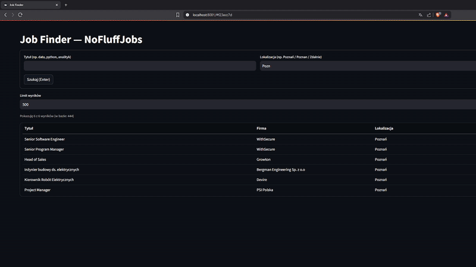

# AI Career Assistant — NFJ Job Finder

Minimalna wyszukiwarka ofert IT z **NoFluffJobs**: ETL → **SQLite** → prosty **Streamlit** z filtrami (tytuł, lokalizacja, seniority).  
Klik w **tytuł** otwiera ogłoszenie w nowej karcie.



---

## Najważniejsze funkcje

- **ETL (NFJ HTML)**: zbiera oferty i robi **UPSERT** po `id=url` → brak duplikatów.  
- **Backfill firmy**: uzupełnia puste nazwy firm z **JSON-LD (JobPosting)** na stronie oferty.  
- **Dashboard (Streamlit)**: szybkie filtry, **ignorowanie polskich znaków** (Poznań ≡ Poznan), limit wyników, tytuł jako link.  
- **SQLite**: prosty deployment (plik `data/ai_jobs.db`).  
- **Logi i metryki**: informacja ile zebrano, zapisano, z jakich źródeł.

**Pola w bazie:** `title, company, location, seniority, url, posted_at, source`.

---

## Szybki start (Windows / PowerShell)

```powershell
# 0) Wirtualne środowisko
python -m venv .venv
.\.venv\Scripts\Activate.ps1

# 1) Zależności
.\.venv\Scripts\pip install -r services\worker\requirements.txt
.\.venv\Scripts\pip install -r services\dashboard\requirements.txt

# 2) (Opcjonalnie) Zbuduj przykładową bazę lub uruchom ETL
#   a) jeśli masz już bazę -> pomiń
#   b) ETL z NoFluffJobs (przykład do 300 ofert):
$env:DB_PATH="data/ai_jobs.db"
$env:NFJ_LIMIT="300"
$env:NFJ_PAGES="8"
$env:NFJ_REMOTE="1"
$env:NFJ_ALL_LISTINGS="1"
$env:NFJ_WORKERS="8"
$env:NFJ_DELAY="0.6"
$env:ETL_FLUSH_EVERY="50"
.\.venv\Scripts\python -m services.worker.etl.main

# 3) Dashboard (port 8001)
$env:DB_PATH="data/ai_jobs.db"
.\.venv\Scripts\python -m streamlit run services\dashboard\app.py --server.port 8001
```

Wejdź: http://localhost:8001

---

## Uzupełnianie nazw firm (backfill)

Jeśli część rekordów ma pustą kolumnę `company`, możesz uzupełnić to bez ponownego scrapowania:

```powershell
.\.venv\Scripts\Activate.ps1
$env:DB_PATH="data/ai_jobs.db"
$env:BACKFILL_LIMIT="1000"
$env:BACKFILL_DELAY="0.5"
$env:BACKFILL_RETRIES="4"
.\.venv\Scripts\python -m services.worker.etl.backfill_company
```

---

## Jak korzystać z wyszukiwarki

- **Tytuł**: wpisz fragment (np. `data`, `python`, `analytics`).  
- **Lokalizacja**: działa bez polskich znaków (np. `Poznan` ≡ `Poznań`).  
- **Seniority**: wpisz `junior`, `mid`, `senior` lub zostaw puste.  
- **Enter** uruchamia szukanie.  
- **Limit wyników** działa natychmiast (poza formularzem).  
- Lista przewija się **w boksie**; **nagłówek i pierwsza kolumna** są „sticky”.  
- Klik w **tytuł** otwiera stronę ogłoszenia.

Na górze widzisz komunikat:  
`Pokazuję X z Y wyników (w bazie: Z)`

---

## Zmienne środowiskowe (ważne)

| Zmienna              | Domyślnie        | Opis |
|----------------------|------------------|------|
| `DB_PATH`            | `data/ai_jobs.db`| Ścieżka do SQLite |
| `NFJ_LIMIT`          | `200`            | Ile ofert zebrać w **tej sesji** ETL |
| `NFJ_PAGES`          | `8`              | Ile stron listy na kategorię |
| `NFJ_REMOTE`         | `1`              | Dodaj listingi `/remote/...` |
| `NFJ_ALL_LISTINGS`   | `1`              | Zbieraj wszystkie podkategorie (jeśli dostępne) |
| `NFJ_WORKERS`        | `8`              | Równoległe pobieranie szczegółów |
| `NFJ_DELAY`          | `0.6`            | Odstęp między żądaniami (throttling) |
| `ETL_FLUSH_EVERY`    | `50`             | Zapis do DB co N rekordów |
| `UI_BOX_HEIGHT`      | `560`            | Wysokość scrollowanego boksu w UI (px) |

---

## Architektura (skrót)

```
services/
├─ worker/
│  └─ etl/
│     ├─ main.py            # pipeline ETL (NFJ HTML -> normalize -> upsert)
│     ├─ sources/
│     │  └─ nofluff.py      # logika pobierania z NoFluffJobs
│     └─ backfill_company.py# uzupełnianie company z JSON-LD (JobPosting)
└─ dashboard/
   └─ app.py                # Streamlit: filtry, limit, sticky kolumny, link w tytule

data/
└─ ai_jobs.db               # SQLite: jobs_table + jobs_clean
```

**Tabela `jobs_clean`** = dane gotowe do UI (po deduplikacji i normalizacji).  
**Klucz rekordu**: `id = url` (stabilny, zapobiega duplikatom).


## Licencja

MIT — patrz `LICENSE`.

---

## Kontakt

**Autor:** Kacper Młynkowiak  
**Repo:** https://github.com/KMlynkowiak/AI-Career-Assistant
